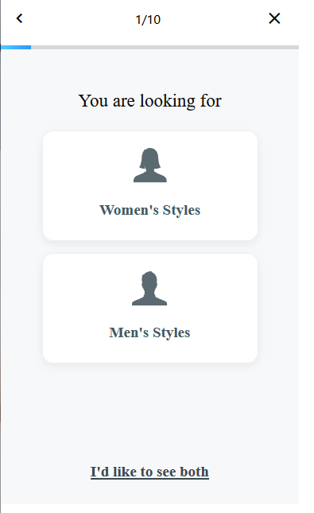
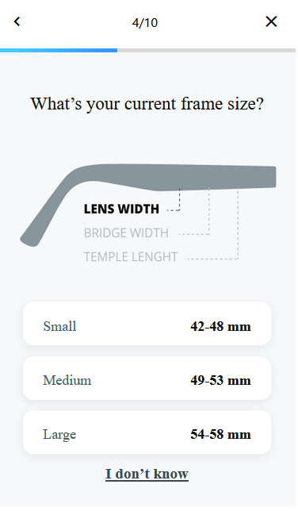
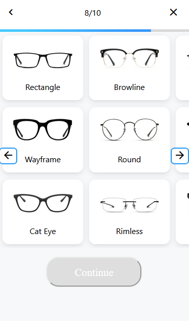
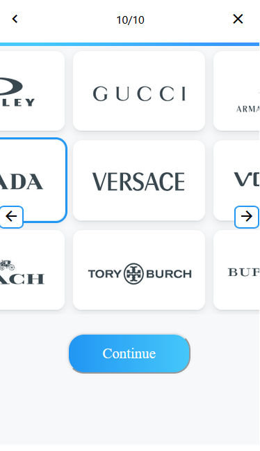
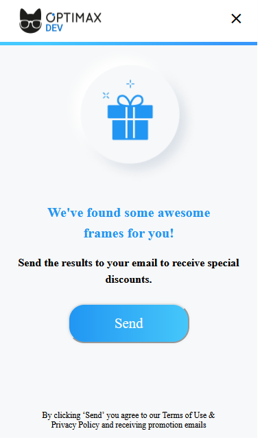

# Процесс сборки скрипта

Этот проект был написан для конкурса по программирования

Суть в написании встраемого виджета для сайта по шаблону

1. npm ci
2. npm run build
3. npm run server
4. Перейти на 127.0.0.1:5000

### Примечания

- Сформированный url можно найти в консоле (После нажатия кнопки Send)
- Тесты находяться в файле widget.test.js

